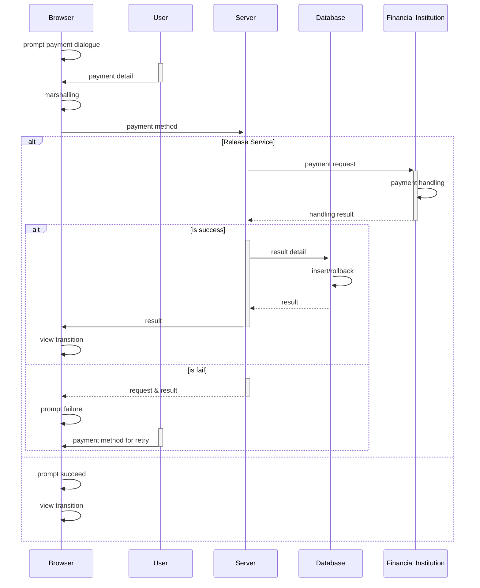
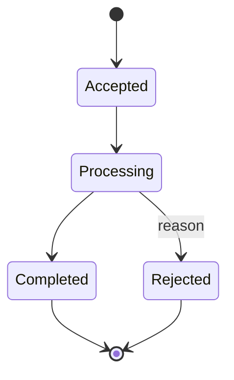

# Document Issue Application

## Data

This function handles form data and documents supporting the application for certification documents issuing.

### Database

Database design for this function will document here.

```mermaid
```

## Business Logic

### Form Data Handling

```mermaid
sequenceDiagram

participant c as Client
participant s as Server
participant d as Database

c->>c: marshalling
c->>+s: form data
s->>s: verification

s->>+d: data
d->>d: insert/rollback
d-->>-s: error/result
s-->>-c: status

activate c
c->>c: view transition
deactivate c
```

### Payment



## Status

### Application


