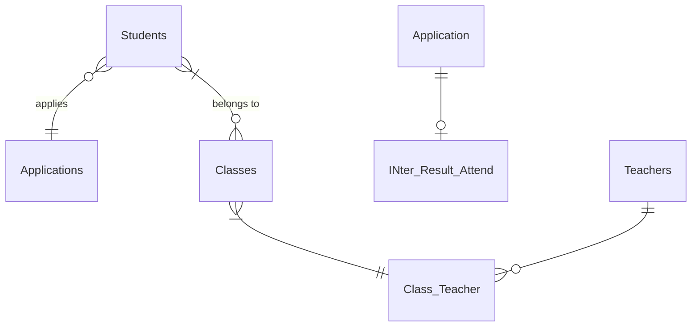
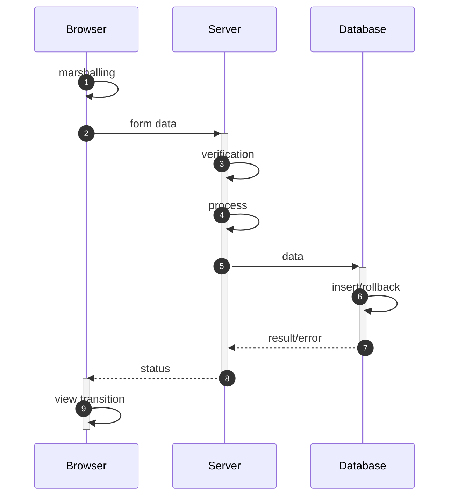
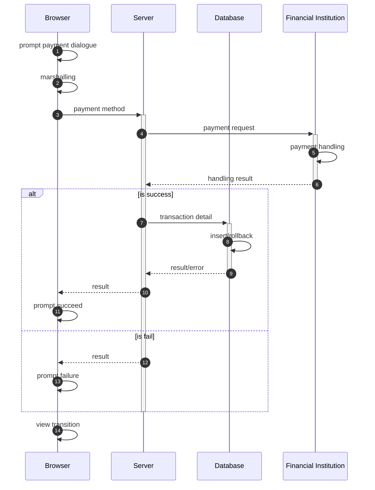
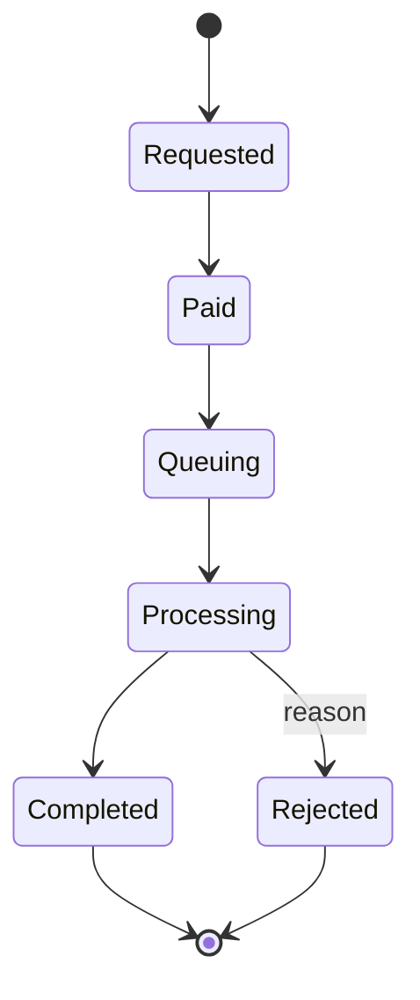
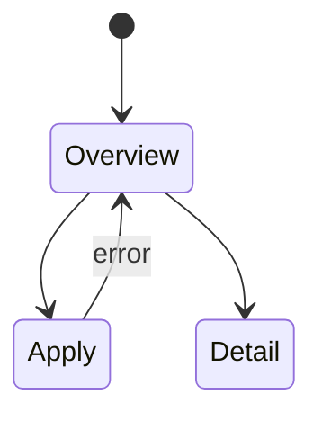
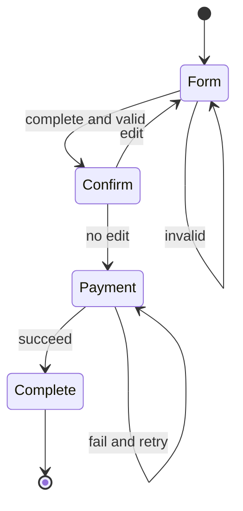

# Document Issue Application

## Database

## Processes

### Submission process

### Payment process

## Status

### Application status

## Client

### page transition

### view transition

view transition for apply page

