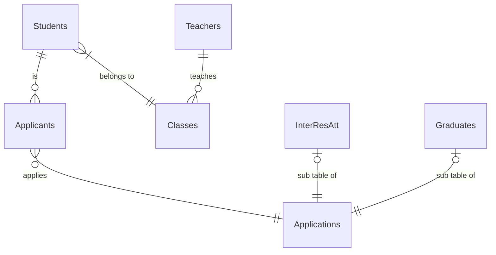
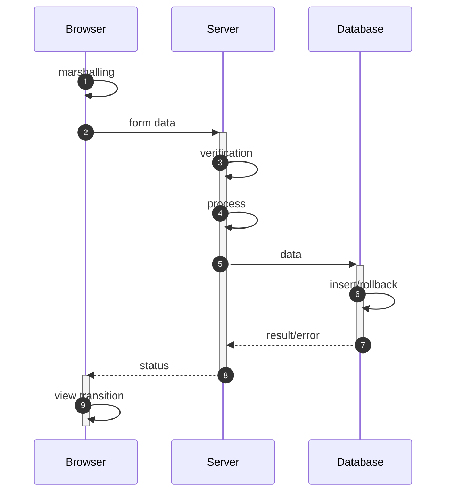
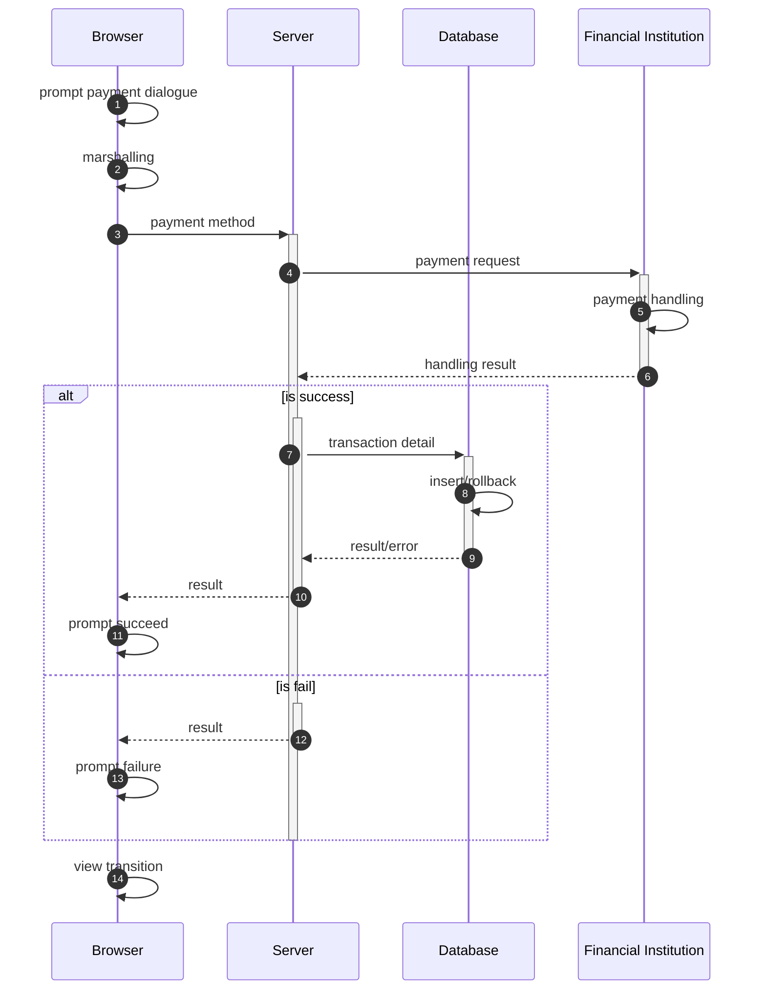
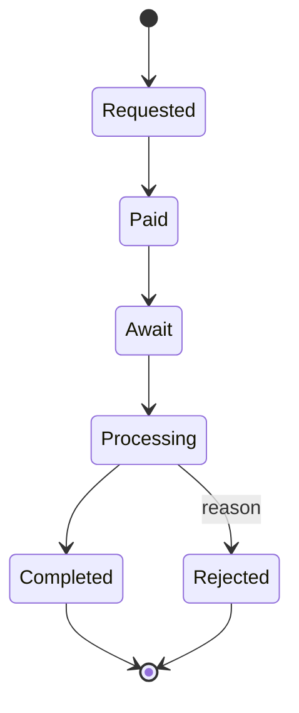
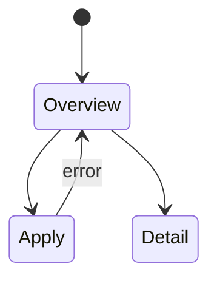
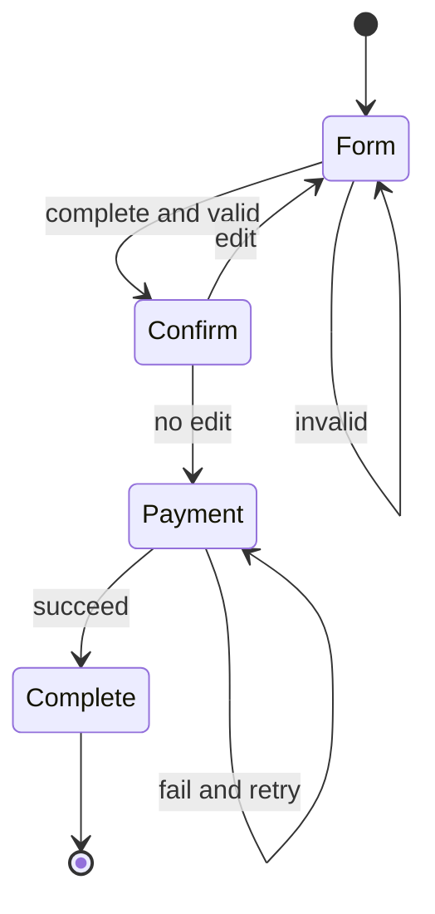

# 証明書発行機能

## 概要

### データベース

本節ではデータベースの基本構造について記述する。

```mermaid
erDiagram

Applicants }o--|| Applications: applies
Students ||--o{ Applicants: is
Students }|--|| Classes: "belongs to"
Teachers ||--o{ Classes: teaches
InterResAtt |o--|| Applications: "sub table of"
Graduates |o--|| Applications: "sub table of"
```

### 申し込み処理

```mermaid
sequenceDiagram
autonumber

participant b as Browser
participant s as Server
participant d as Database

b->>b: marshalling
b->>+s: form data
s->>s: verification
s->>s: process

s->>+d: data
d->>d: insert/rollback
d-->>-s: result/error
s-->>-b: status

activate b
b->>b: view transition
deactivate b
```

### 支払処理

```mermaid
sequenceDiagram
autonumber

participant b as Browser
participant s as Server
participant d as Database
participant f as Financial Institution

b->>b: prompt payment dialogue
b->>b: marshalling
b->>+s: payment method
s->>+f: payment request
f->>f: payment handling
f-->>-s: handling result

alt is success
    activate s
    s->>+d: transaction detail
    d->>d: insert/rollback
    d-->>-s: result/error
    s-->>-b: result
    b->>b: prompt succeed
else is fail
    activate s
    s-->>-b: result
    b->>b: prompt failure
end

deactivate s
b->>b: view transition
```

### 申し込みステータス

```mermaid
stateDiagram
[*] --> Requested
Requested --> Paid
Paid --> Await
Await --> Processing

Processing --> Completed
Completed --> [*]

Processing --> Rejected: reason
Rejected --> [*]
```

## クライアント側

### 画面遷移 (ページ)

```mermaid
stateDiagram

[*] --> Overview
Overview --> Apply
Apply --> Overview: error
Overview --> Detail
```

### 画面遷移 (申し込みページ)

view transition for apply page

```mermaid
stateDiagram

[*] --> Form
Form --> Confirm: complete and valid
Form --> Form: invalid
Confirm --> Form: edit
Confirm --> Payment: no edit
Payment --> Complete: succeed
Payment --> Payment: fail and retry
Complete --> [*]
```

## サーバー側
