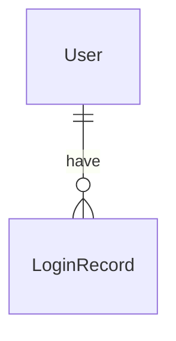
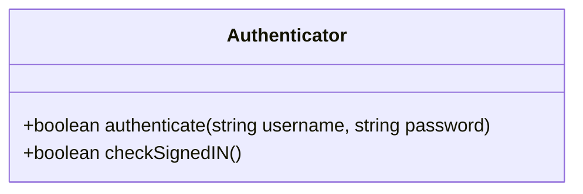
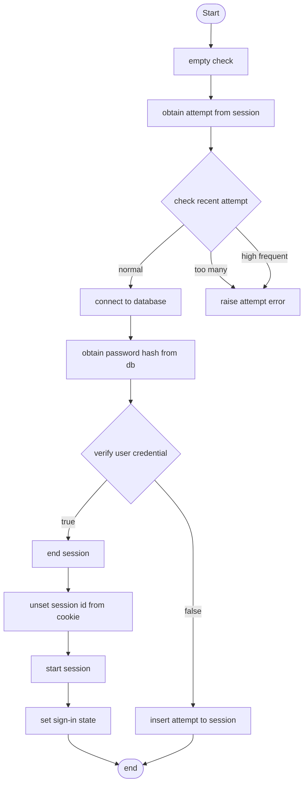
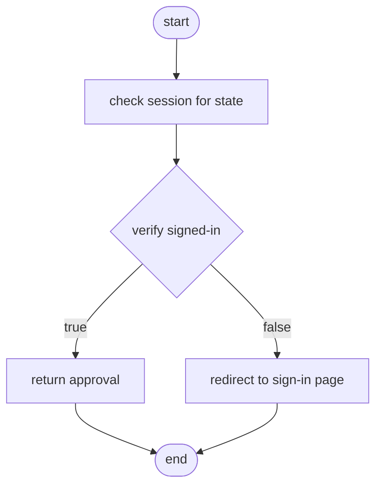

# Functional Specification (auth)

## Database

```mermaid
erDiagram

User ||--o{ LoginRecord: have
```

Users(studentID(PK), password, year(PK))
LoginRecord(studentID(PK), year(PK), moment)

## Model

```mermaid
classDiagram
class Authenticator {
    +boolean authenticate(string username, string password)
    +boolean checkSignedIN()
}

```

## Process

### Sign in

```mermaid
graph TD

st([Start])
st --> ec[empty check]
ec --> oa[obtain attempt from session]
oa --> va{check recent attempt}

va -->|normal| cd[connect to database]
va -->|too many| ae[raise attempt error]
va -->|high frequent| ae

cd --> oh[obtain password hash from db]
oh --> vc{verify user credential}

vc -->|true| es[end session]
es --> uc[unset session id from cookie]
uc --> ss[start session]
ss --> sl[set sign-in state]
sl --> ed([end])

vc -->|false| ia[insert attempt to session]
ia --> ed
```

### Sign-in check

```mermaid
graph TD

st([start])
st --> cs[check session for state]
cs --> vs{verify signed-in}

vs -->|true| pc[return approval]
pc --> ed([end])

vs -->|false| rd[redirect to sign-in page]
rd --> ed
```
