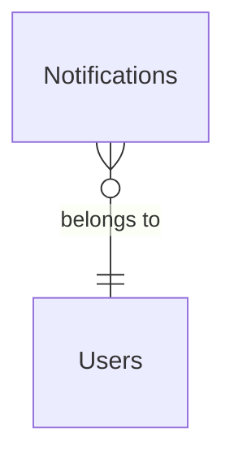
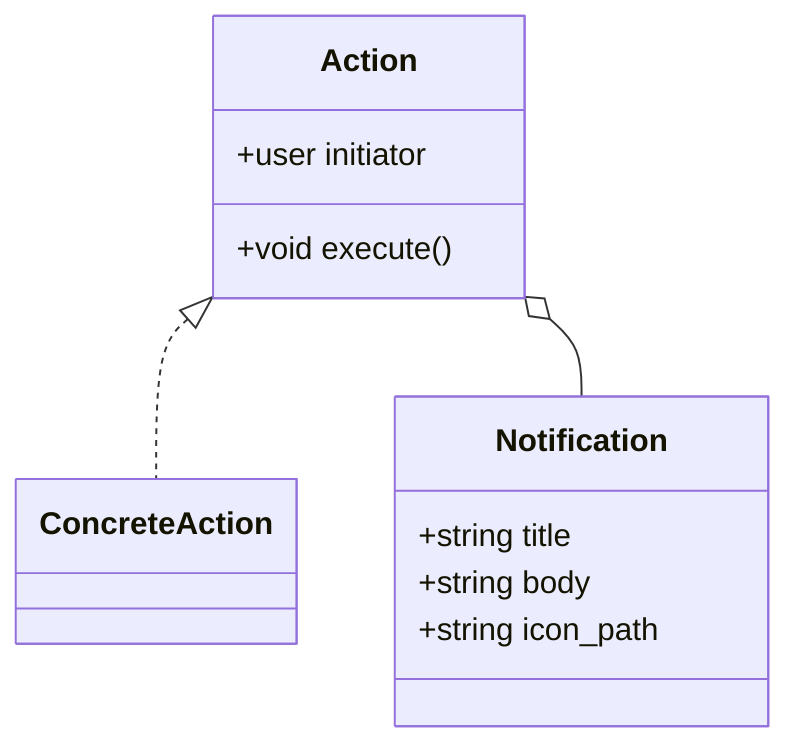
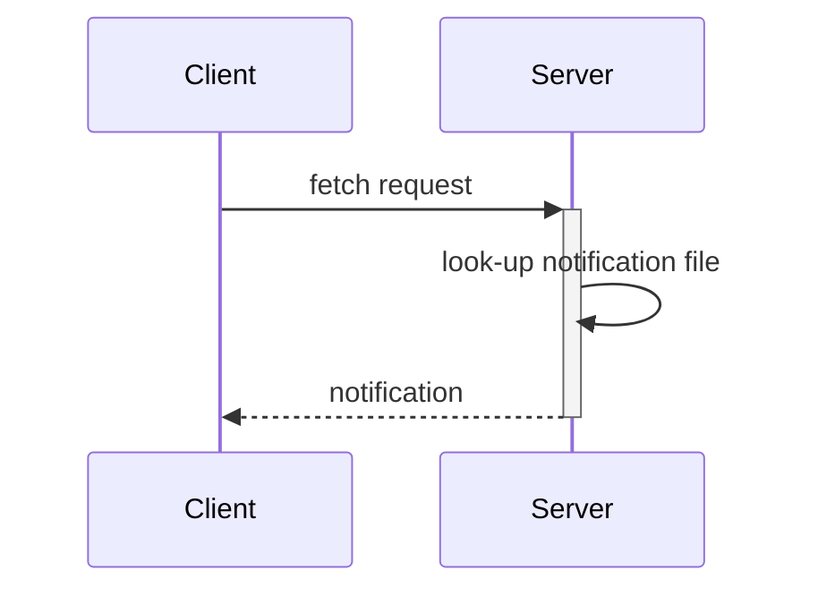
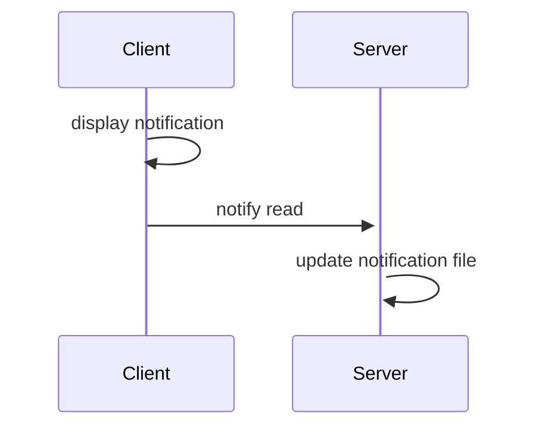
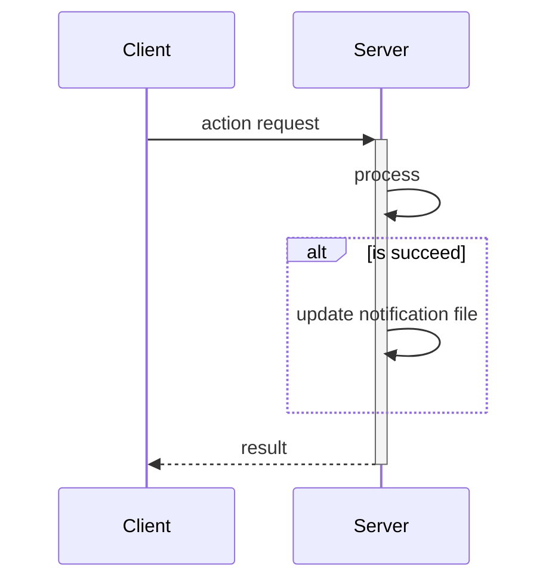

# Functional Specification (notif)

## Database

## Model

## Processes

notification file is a plain text JSON file and will named in `[Session ID].notif.tmp` form.

### Periodical Fetch

### Read Notification

### Update Action

